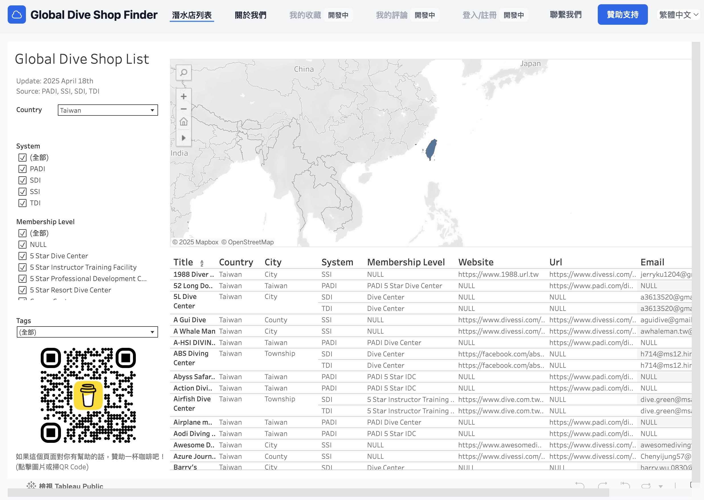

# 🌊 Global Dive Shop Discover

一個專為潛水愛好者打造的資訊平台，整合了全球主流潛水系統（如 PADI、SSI、SDI 等）的潛水店資料，幫助潛水人快速找到值得信賴的潛店，無論你是初學者還是資深潛水員，都能安心探索海底世界。

---

## 🚀 特色功能

- ✅ 整合來自多個潛水系統的潛店資料
- 🔍 支援依 **國家、潛水系統、等級、標籤** 等條件篩選
- 📊 使用 Tableau 提供直覺的資料視覺化圖表
- 🌐 多語系介面（目前為繁體中文，英文開發中）
- 🧭 手機響應式設計，操作方便
- 💬 預設彈窗，提供新手操作說明與網站理念

## 📘 使用說明

1. 先選擇 **國家**（可多選，也支援關鍵字搜尋）
2. 再選擇 **潛水系統**（如 PADI、SSI、SDI 等）
3. 根據條件進一步篩選（等級、標籤等）
4. 點擊潛店卡片，可查看詳細資訊（視覺圖表由 Tableau 提供）

---

## 🔧 技術說明

- 前端框架：純 HTML + [Tailwind CSS](https://tailwindcss.com/)
- 資料視覺化：Tableau Public 嵌入式圖表
- 無需登入即可使用
- 無後端，全部為靜態前端頁面

## 🧑‍💻 開發者

這是一個由 **1 人獨立開發** 的專案，出發點是因為自己熱愛潛水，卻發現目前潛水店資訊非常零散。希望能提供一個更方便、可靠的資料整理平台。

如果你覺得這個網站對你有幫助，也歡迎[請我喝杯咖啡 ☕](https://www.buymeacoffee.com/diveshopdiscover) ❤️

## 📫 聯絡與回饋

📋 若發現錯誤、資料需要更新、或有功能建議，請透過這個表單與我聯繫：

👉 [填寫聯絡表單](https://o3clrk7y.forms.app/globaldiveshopdiscover)

## 📌 TODO／未來功能計劃

- [ ] 使用者評論與收藏潛店功能
- [ ] 潛水地點地圖整合（使用 Mapbox / Leaflet）
- [ ] 更多篩選條件與標籤功能
- [ ] 語言切換（英文版）
- [ ] 開放資料 API

## 📄 授權 License

本網站為開源項目，採用 MIT License。資料來源皆來自公開網路資源，其版權屬於原平台所有。
